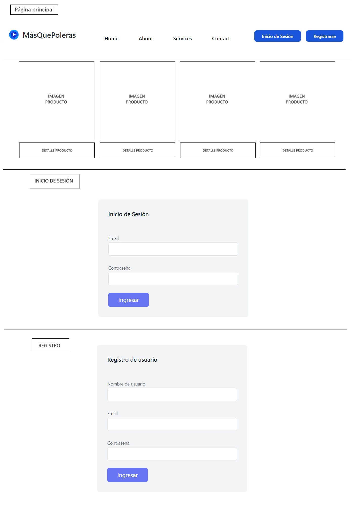

# PROYECTO 5: Ecommerce App

## **ÍNDICE**

* [1. Descripción](#1-descripci%C3%B3n)
* [2. Prototipo](#2-prototipo)
* [3. Requisitos](#3-requisitos-y-entregables)
* [4. Criterios de evaluación](#4-criterios-de-evaluaci%C3%B3n)

## 1. Descripción
El quinto proyecto del Bootcamp, titulado "Ecommerce App", está en desarrollo.

Este proyecto consiste en la creación de una página web de comercio electrónico utilizando tecnologías como React, ExpressJS, Node, MongoDB y Vite, además de Twiling CSS. La aplicación incluye un listado de productos disponibles para la compra.

Los productos, el registro de usuarios y el inicio de sesión están integrados con sus respectivas APIs.

El usuario puede seleccionar un producto haciendo clic sobre él, lo que redirige a una página con la descripción detallada del mismo. En esta página, el usuario puede añadir el producto al carrito de compras. También es posible regresar a la página principal para seleccionar más productos, eliminar productos del carrito o vaciar el carrito por completo.

Para registrarse, el usuario debe proporcionar un nombre de usuario, correo electrónico y contraseña. Si se cumplen los requisitos, se mostrará un mensaje indicando que el registro fue exitoso. Posteriormente, el usuario podrá iniciar sesión con las mismas credenciales mediante el botón "Inicio de sesión". Si las credenciales son correctas, se mostrará un mensaje de "Inicio de sesión exitoso"; de lo contrario, se indicará que el usuario no existe.

## 2. Prototipo

## 3. Requisitos y entregables

### FRONTEND
- [ ] Desarrollar prototipado simple.
- [ ] Uso de ReactJS
- [ ] Uso de Context API
- [ ] Ruta de Home
- [ ] Ruta de Checkout
- [ ] Ruta de registro de usuario
- [ ] Ruta de inicio de sesión
- [ ] Ruta de "Mi perfil"
- [ ] Ruta de Producto individual
- [ ] Ruta de Listado de productos

### BACKEND
- [ ] Uso de ExpressJS
- [ ] Creación y gestión de rutas necesarias para el funcionamiento del Frontend

### DESPLIEGUE
- [ ] Crear una URL para compartir (puedes utilizar Netlify o GitHub Pages).
- [ ] Colocar descripción dentro del repositorio.

****

## 4. Criterios de evaluación

| ÁREA       | % DEL TOTAL |
| ------------- |:-------------:|
| FRONTEND + BACKEND - FLUJO DE DATOS ENTRE ELLOS      | 70%     |
| CONTROL DE VERSIONES     | 10%     |
| DESPLIEGUE | 10%      |
| ENTREGA A TIEMPO | 10%      |

****

****
